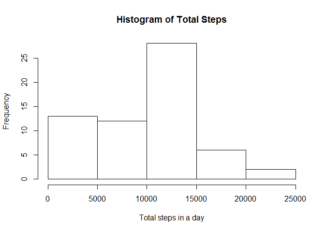
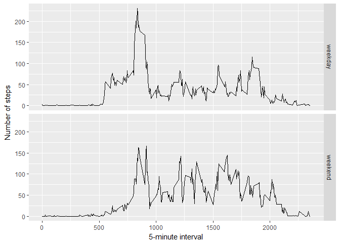

# RepData_PeerAssessment-project 1
Barry Garman  
May 20, 2017  


# Markdown & knitr Course Peer Review Project-1

## R code chunk for loading data

```r
unzip(zipfile="activity.zip")
data <- read.csv("activity.csv")
```

## R Code chunk to get the mean total number of steps taken per day.

```r
library(ggplot2)
```

```
## Warning: package 'ggplot2' was built under R version 3.3.3
```

```r
total_steps <- tapply(data$steps, data$date, FUN=sum, na.rm=TRUE)
qplot(total_steps, binwidth=1000, xlab="total number of steps taken each day")
```

<!-- -->

```r
#dev.copy(png, "Total_Steps.png", width = 480, height = 480)
#dev.off()
mean(total_steps, na.rm=TRUE)
```

```
## [1] 9354.23
```

```r
median(total_steps, na.rm=TRUE)
```

```
## [1] 10395
```

## R Code chunk to get the average daily activity pattern.

```r
library(ggplot2)
averages <- aggregate(x=list(steps=data$steps), by=list(interval=data$interval),
                      FUN=mean, na.rm=TRUE)
ggplot(data=averages, aes(x=interval, y=steps)) +
    geom_line() +
    xlab("5-minute interval") +
    ylab("average number of steps taken")
```

<!-- -->

```r
#dev.copy(png, "Average_Daily_Activity_Pattern.png", width = 480, height = 480)
#dev.off()
```

## R Code chunk to get the average across all the days in the dataset. 

```r
averages[which.max(averages$steps),]
```

```
##     interval    steps
## 104      835 206.1698
```

## Imputing missing values

There are many days/intervals where there are missing values (coded as `NA`). The presence of missing days may introduce bias into some calculations or summaries of the data.


```r
missing <- is.na(data$steps)
# How many missing
table(missing)
```

```
## missing
## FALSE  TRUE 
## 15264  2304
```

All of the missing values are filled in with mean value for that 5-minute
interval.


```r
# Replace each missing value with the mean value of its 5-minute interval
fill.value <- function(steps, interval) {
    filled <- NA
    if (!is.na(steps))
        filled <- c(steps)
    else
        filled <- (averages[averages$interval==interval, "steps"])
    return(filled)
}
filled.data <- data
filled.data$steps <- mapply(fill.value, filled.data$steps, filled.data$interval)
```
## R Code chunbk to plot a histogram of the total number of steps taken each day and calculate the mean and median total number of steps.


```r
total_steps <- tapply(filled.data$steps, filled.data$date, FUN=sum)
qplot(total_steps, binwidth=1000, xlab="total number of steps taken each day")
```

<!-- -->

```r
#dev.copy(png, "Total_Steps_Daily.png", width = 480, height = 480)
#dev.off()
mean(total_steps)
```

```
## [1] 10766.19
```

```r
median(total_steps)
```

```
## [1] 10766.19
```

## Mean and median values are higher after imputing missing data. 

## R Code chunk to get the differences in activity patterns between weekdays and weekends.


```r
weekday.or.weekend <- function(date) {
    day <- weekdays(date)
    if (day %in% c("Monday", "Tuesday", "Wednesday", "Thursday", "Friday"))
        return("weekday")
    else if (day %in% c("Saturday", "Sunday"))
        return("weekend")
    else
        stop("invalid date")
}
filled.data$date <- as.Date(filled.data$date)
filled.data$day <- sapply(filled.data$date, FUN=weekday.or.weekend)
```

## R code chunk to plot average number of steps taken on weekdays and weekends.

```r
averages <- aggregate(steps ~ interval + day, data=filled.data, mean)
ggplot(averages, aes(interval, steps)) + geom_line() + facet_grid(day ~ .) +
    xlab("5-minute interval") + ylab("Number of steps")
```

<!-- -->

```r
#dev.copy(png, "Average_Number_Of_Steps.png", width = 480, height = 480)
#dev.off()
```
